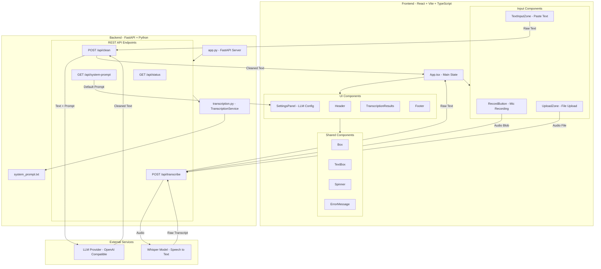

# AI Transcript App - Architecture

## Architecture Overview

### Frontend (React + TypeScript + Vite)

- **App.tsx**: Main application component managing all state and API communication
- **Input Components**:
  - `RecordButton`: Captures audio via browser MediaRecorder API
  - `UploadZone`: Drag-and-drop or file picker for audio files
  - `TextInputZone`: Direct text input for existing transcripts
- **UI Components**:
  - `SettingsPanel`: Toggle LLM cleaning and customize system prompt
  - `TranscriptionResults`: Display raw and cleaned transcription results

### Backend (FastAPI + Python)

- **app.py**: FastAPI server with CORS support for local development
- **transcription.py**: Core service handling Whisper and LLM integration
- **API Endpoints**:
  | Endpoint | Method | Description |
  |----------|--------|-------------|
  | `/api/status` | GET | Service health and model info |
  | `/api/transcribe` | POST | Convert audio to text via Whisper |
  | `/api/clean` | POST | Clean text via LLM |
  | `/api/system-prompt` | GET | Get default LLM instructions |

### External Services

- **Whisper (faster-whisper)**: Local speech-to-text model
- **LLM Provider**: OpenAI-compatible API (Ollama, OpenAI, LM Studio, etc.)

## Data Flow

1. **Audio Recording/Upload** → Frontend captures audio → Sends to `/api/transcribe`
2. **Transcription** → Backend uses Whisper to convert speech to text → Returns raw transcript
3. **LLM Cleaning** (optional) → Raw text sent to `/api/clean` → LLM removes filler words, fixes grammar → Returns cleaned text
4. **Display Results** → Frontend shows both raw and cleaned transcriptions
